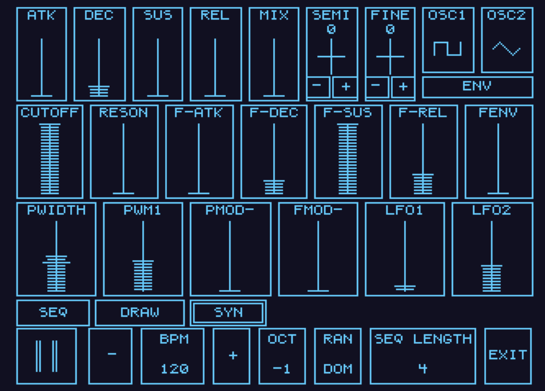
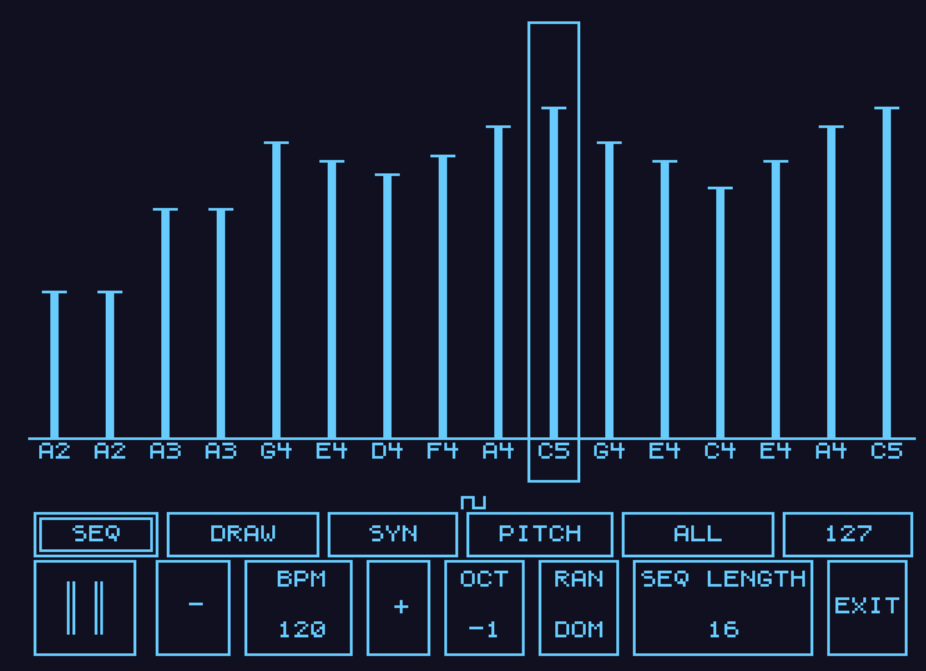
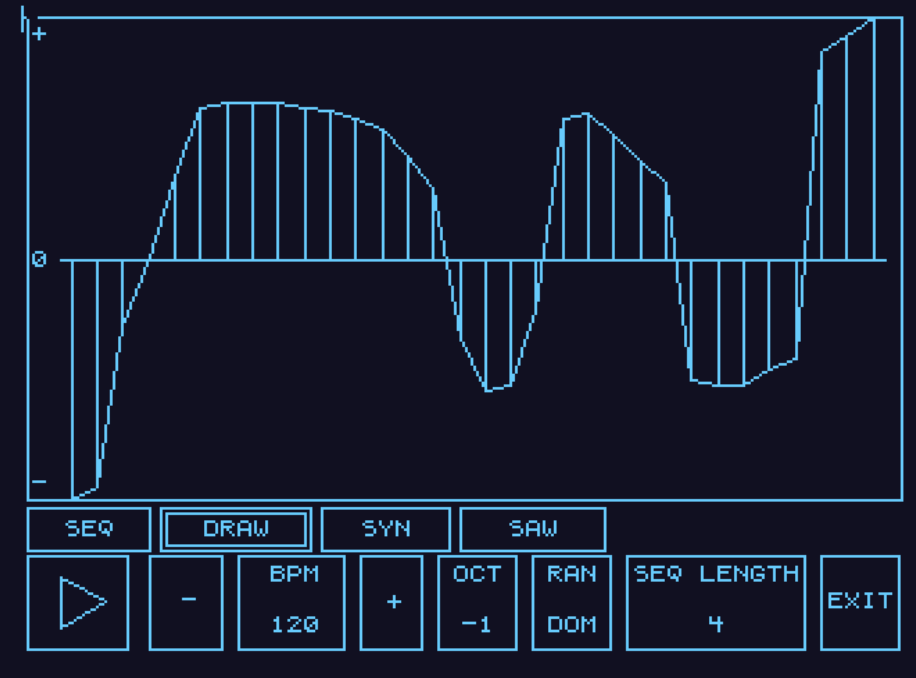

# Amiga Synth

A software synthesizer for the Amiga 1200. It takes over the machine: the sequencer, the synth controls, and a drawable oscillator.







## Run

Copy `amisynth.exe` to the Amiga. From the Shell, run it. **EXIT** returns to Workbench. Pressing both mouse buttons does the same.

A stock PAL A1200 and a mouse are enough. Copy `amisynth.exe.info` next to the program if you want the icon in a Workbench drawer. The icon file has to keep the same name as the program.

## FX

The **FX** tab has distortion (**DRIVE**), a tempo delay (**STEP** in sequencer sixteenths, **LEVEL**, **FDBK**) and a reverb (**DECAY**, **LEVEL**). Paula loops single-cycle waves, so delay and reverb replay the notes themselves on the right-hand voices while the dry sound stays on the left. With both levels at zero, both sides play the dry sound as before. Drive clips the wave shape and the envelope: saw, triangle and filtered sounds get grittier, and every note holds up longer as it fades. A plain square or pulse is already fully clipped, so on those you hear the sustain rather than a change in tone. The ranges and defaults are in `src/config.h`.

## Releases

Publishing a GitHub release builds `amisynth.exe` and attaches it to that release, together with the Workbench icon. The same workflow can be run by hand from the Actions tab, and that run attaches the files to the latest release.

## Build

Build with the [Amiga Debug](https://github.com/BartmanAbyss/vscode-amiga-debug) toolchain (`m68k-amiga-elf-gcc` and `elf2hunk`) on your `PATH`:

```sh
make
```

The program is written to `out/amisynth.exe`.
